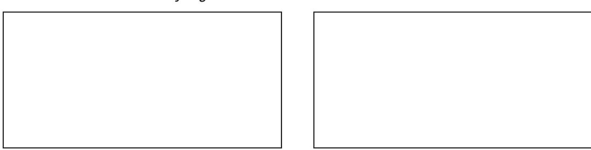
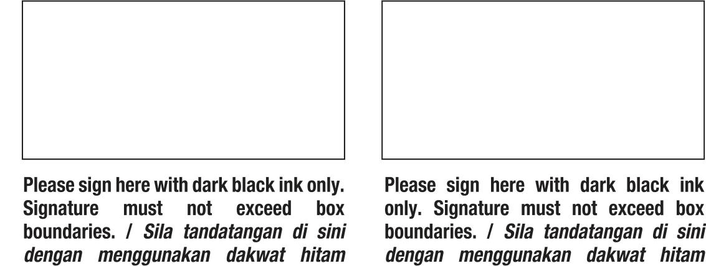

<PAGE>
[Non-Text]
PUBLIC BANK
[Non-Text]
PUBLIC ISLAMIC BANK
TURKISH BANK
YETI BANK
YETI BANK
VISA
Supplementary Card Application Form / Borang Permohonan Kad Tambahan
I WISH TO APPLY FOR (TICK 📞 WHERE APPROPRIATE): / SAYA INIGIN MEMOHON UNTUK (TANDAKAN 📞 DALAM KOTAK YANG BERKENAAN):
PUBLIC BANK CREDIT CARD / KAD KREDIT PUBLIC BANK:
PUBLIC BANK VISA INFINITE
PUBLIC BANK WORLD MASTERCARD
PUBLIC BANK VISA SIGNATURE
PUBLIC BANK QUANTUM CREDIT CARDS
PUBLIC BANK VISA PLATINUM
PUBLIC BANK PLATINUM MASTERCARD
PUBLIC BANK AIA VISA GOLD
PUBLIC BANK VISA GOLD
PUBLIC BANK GOLD MASTERCARD
PUBLIC ISLAMIC BANK CREDIT CARD-I / KAD KREDIT-I / PUBLIC ISLAMIC BANK:
PUBLIC ISLAMIC BANK VISA PLATINUM
PUBLIC ISLAMIC BANK PLATINUM MASTERCARD
PUBLIC ISLAMIC BANK VISA GOLD
PUBLIC ISLAMIC BANK GOLD MASTERCARD
PLEASE COMPLETE APPLICATION FORM IN FULL. Type or print in BLOCK LETTERS throughout.
SILA ISI BORANG PERHOONAN DENGAN LENGKAP. Tlap atau Luis dengan Hurruve BESAI Keseluruhannya.
<table><tr><td rowspan="2">1</td><td rowspan="2" colspan="2">PRINCIPAL CARD/EMBRIER PERSONAL DATA BUTIT-BUTIT PERIBADI KAD UTAMA</td><td rowspan="2" colspan="2">OFFICE TELEPHONE &amp; EXTENSION NO. / No. TELEFON PEJABAT DAN SAMBUNGAN</td></tr><tr></tr><tr><td>NEW NRIC NO. / NO. KP BABARU</td><td></td><td></td><td></td><td></td></tr><tr><td>OLD NRIC/PASSPORT NO.</td><td></td><td></td><td></td><td></td></tr><tr><td>NO. KP LAMA/PASSPORT</td><td></td><td></td><td></td><td></td></tr><tr><td>FULL NAME AS IN NRIC/PASSPORT / NAMA PENUH SEPTERTI DALAM KPPASSPORT</td><td></td><td></td><td></td><td></td></tr><tr><td>EXISTING PRINCIPAL PB CARD ACCOUNT</td><td></td><td></td><td></td><td></td></tr><tr><td>NO. AKALIN AHU KAD PB UTAMA YANG SEDIA ADA</td><td></td><td></td><td></td><td></td></tr><tr><td>VISA:</td><td></td><td></td><td></td><td></td></tr><tr><td></td><td></td><td></td><td></td><td></td></tr><tr><td>MASTERCARD:</td><td></td><td></td><td></td><td></td></tr><tr><td></td><td></td><td></td><td></td><td></td></tr><tr><td>2</td><td>SUPPLEMENTARY CARD / KAD TAMBahan</td><td></td><td></td><td></td></tr><tr><td>NEW NRIC NO. / NO. KP BAHARI</td><td></td><td></td><td></td><td></td></tr><tr><td>OLD NRIC/PASSPORT NO.</td><td></td><td></td><td></td><td></td></tr><tr><td>NO./ KP LAMA/PASSPORT</td><td></td><td></td><td></td><td></td></tr><tr><td>NAME TO APPEAR ON CARD / NAMA PADA KAD</td><td></td><td></td><td></td><td></td></tr></table>
FULL NAME AS IN NRIC/PASSPORT / NAMA PENUH SEperti DIALAM KP/PASSPORT
<table><tr><td colspan="4">DATE OF BIRTH (DD-MM-YY) / TARIKH LAHR (HH-BB-TT)</td></tr></table>
EMERGENCY CONTACT NO. / NO. TELEFON KECEMASAN
<table><tr><td>RACE</td><td>NATIONALITY</td></tr><tr><td>BANOSA</td><td>KEWARGANEGARAN</td></tr><tr><td colspan="2">MAILING ADDRESS / ALAMAT SURAT MENYUARAT</td></tr><tr><td colspan="2"></td></tr><tr><td>POSTCODE / POSKOD</td><td>STATE / NEGERI</td></tr><tr><td colspan="2">HOME TEL. NO.</td></tr><tr><td>NO. TEL. RUMAH</td><td></td></tr><tr><td colspan="2">MOBILE NO.</td></tr><tr><td>NO. TELEFON MUDAH ALIH</td><td></td></tr></table>
OFFICE TELEPHONE & EXTENSION NO. / NO. TELEFON PEJABAT DAN SAMBUNGAN
<table><tr><td></td><td></td><td></td><td></td><td></td><td></td><td></td><td></td><td></td><td></td><td></td><td></td><td></td><td></td><td></td><td></td><td></td><td></td></tr><tr><td></td><td></td><td></td><td></td><td></td><td></td><td></td><td></td><td></td><td></td><td></td><td></td><td></td><td></td><td></td><td></td><td><td></td></tr></table>
NAME OF EMPLOYER/COMPANY
NAMA MALIKAN/STAKRIAT
<table><tr><td>SALARIEDI | BERGAU</td><td>NON-SALARIED | TIDAK BERGAU</td></tr></table>
POSITION / JAIWATAN
YEARS OF SERVICE | TEMPOH PERKHIDMATAN ____
NATURE OF BUSINESS
JENIS PERNIAGAN ____
MONTHLY STATEMENT / PENYATA BULANAN
COMBINED / DIGABUNGKAN
PRINCIPAL AND SYNDICIPENCY CARRGEMBER'S CARD ACTIVITIES TO BE SENT TO PRINCIPAL CARDMEMBER / ACTIVITI KAD AHLI KAD UTAMA DAN TAMBANAN AKAN DINHANTAR KEPADA AHLI KAD UTAH KAD UTAMA
SEPARATE / BERASINGAN
SUPPLEMENTARY CARDGEMBER'S CARD ACTIVITIES TO BE SENT TO SUPPLEMENTARY CARDGEMBER / ACTIVITI KAD AHLI KAD TAMBANAN AKAN DINHANTAR KEPADA AHLI KAD TAMBANAN
NONMINATED CREDIT LINE PER CARD (MINIMUM RM1,000) / KEMUDAHAN KREDIT YANG DIFFERINITKXANI UNTUK SETIAP KAD (MINIMUM RM1,000)
3 SMS TRANSACTION ALERT FOR SIGNATURE BASED TRANSACTIONS / MAKLUMAN SEGERA TENTANG URUS NAGA BERASSAKAN TANADATAN NGAN MELALUSI SMS
PLEASE SELECT YOUR PREFERRED THRESHOLD AMOUNT SILA PILIN HAD AMBANG PILUHAN ANDA
<table><tr><td>RMS00</td><td>RMI1,000</td><td>RMI2,000</td><td>RMI3,000</td><td>RMI5,000</td></tr></table>
OPT OUT (DO NOT SEND ANY SMS TRANSCITION ALERT TO ME.) Please refer to the Product Disclosure Sheet for the risks. I TIDAK PERULI (JANGAN HANTAR MANKALAN SEKSIAN TERHIDAI IRUS NAGA MELALUH SMS KEPADA SAYA.) Silu rujuk kepada Lembaran Pendedadan Produk tentang risklo-risknanya.
NOTE: THE BANK'S DEFAULT VALUE (RM500) APPLIES IF LEFT BLANK
NOTA: JAKALU TIDAK DITANDA, HAD ANAK MENIGKUTI KADAR (RM500) YANG TELAH DITETAPKAN OLEH PIHAK BANK
4 CARD DELIVERY AND BILLING OPTIONS INSTRUCTIONS PENGHANTARAN KAD DAN OPSYEN PENERIMAAN PENYATA
CARD COLLECTION INSTRUCTIONS / MAKLIMAN MENGEAN PENGHANTARAN KAD
HOME ADDRESS / ALAMAT RUMAH     OFFICE ADDRESS / ALAMAT PEJABAT
(MA NORTHLY FEE OF RM1 IS CHARGABLE FOR HARDCOPY STATEMENT / FI BULANAN
SEABANK RMI DINEKANAN BAGI PENYATA DALAM SULIMAN KERASI)
PUBLIC BANK BERHAD 119650100072 (463-H) / PUBLIC ISLAMIC BANK BERHAD 197301001433 (14328-V)
FORMS/PBC009/REV612615/YJK
<PAGE>
<table><tr><td>5</td><td>PREFERENCE TO RECEIVE -ENJOYCE (MANADATORY FOR SEPARATE MONTHLY STATEMENT) / KEUTAMAM UNTUK MENFERIMA -ENVOUS (WAJIB UNTUK PENYATA BULANAN BERASINGAN)</td></tr><tr><td colspan="2">WOULD YOU LIKE TO REGISTER FOR E-INVOICE?ADAKAH ANDA INGINI MENDAFATAR UNTUK-ENVOIS?</td></tr><tr><td colspan="2">NOTE: IF YOU DOK&#x27;T NOT, NO E-INVOICE WILL BE GENERATED/ISSUED TO YOU.NOTA: JIKA ANDA TANDA &quot;ITAKK&quot;, TADA E-INVOIS AKAN DIKELIAKURAN REPADA ANDA.</td></tr><tr><td colspan="2">TAX IDENTIFICATION NUMBER (TIN)NOMBOP FREMENZAJOUK (TKI) 1TOTAL: INVOICE TAKING CANNOT BE CANCE LET/ESSUED/ISSUED UNTIL A VALID TIN IS PROVIDED.NOTA: E-INVOIS TIDAK BOLIH DIELIKUARAN SENGHUKA TI NING YAN SAH DIEMIKAKAN.</td></tr><tr><td colspan="2">SALES &amp; SERVICE TAX (SST) REGISTRATION NUMBER (MANDATORY FOR SST REGISTRANT) / NOMBOP FREMENZAJOUK (TKI) 1TOTAL: INVOICE PENDING FADTAIRAN CUKU JALAIN &amp; PERKOHMATAN (WAJB UNTUK PENDATAR SST)</td></tr><tr><td>6</td><td>FATCA AND CRB SELF-CERTIFICATION / PENGESAHANDIN-FATCA AND CRB</td></tr><tr><td colspan="2">Are you a resident for tax purposes in any country other than Malaysia? / Adakah anperiasa/utang yang melaykar cukui di mana-mana negara selain Malaysia?</td></tr><tr><td></td><td>YES. Please indicate Country of Tax Residency and Tax ID Number 1 YA. Sia nyatakan kepadaan Negara Selisih Cukai dan Nomor ID Cukai</td></tr><tr><td colspan="2">COUNTRY OF TAX RESIDENCY / NEGARA RESIDENCI CUKAI</td></tr><tr><td colspan="2">TAX ID NUMBER / NOMOR ID CUKAI</td></tr><tr><td colspan="2">If no Tax ID Number, please indicate the reason / Jika faida Nomor ID Cukai, sila nyatakan sebagai</td></tr><tr><td colspan="2">CERTIFIED RELEVANT AND VALID FATCA DOCUMENTS / DOKUMMEN FATCA YANG DISAKHAN BERKATIAN DARI SAN</td></tr><tr><td colspan="2">COUNTRY OF TAX RESIDENCY / NEGARA RESIDENCI CUKAI</td></tr><tr><td colspan="3">TAX ID NUMBER / NOMOR ID CUKAI</td></tr><tr><td colspan="3">If no Tax ID Number, please indicate the reason / Jika faida Nomor ID Cukai, sila nyatakan sebagai</td></tr><tr><td colspan="2"></td><td>Please sign here with dark black ink only. Signature must not exceed box boundaries. / Sila tandatangan di sini dengan menggunakan dakwah hitam saham. Yandatangan hendaklah tidak melebihi pendapatan petak.</td></tr><tr><td colspan="2">SISAN TURNBER / NOMOR ID CUKAI</td><td>SISAN TURNBER / NOMOR ID CUKAI</td></tr><tr><td colspan="2">TAT INK DUMBER / NOMOR ID CUKAI</td><td>TAT INK DUMBER / NOMOR ID CUKAI</td></tr><tr><td colspan="2">If no Tax ID Number, please indicate the reason / Jika faida Nombor ID Cukai, sila nyatakan sebagai</td><td>If no Tax ID Number, please indicate the reason / Jika tidak Nombor ID Cukai, sila nyatakan sebagai</td></tr><tr><td colspan="2">CERTIFIED RELEVANT AND VALID FATCA DOCUMENTS/ DOKUMENT FATCA YANG DISAKHAN BERKATIAN DAN SAYI</td><td>CERTIFIED RELEVANT AND VALID FATCA DOCUMENTS/ DOKUMENT FATCA YANG DISAKHAN BERKATIAN</td></tr><tr><td colspan="2">FORM W-9 / BORANG W-9</td><td>FORM W-9BEN / BORANG W-9BEN</td></tr><tr><td colspan="2">OTHERS, PLEASE SPECIFY</td><td></td></tr><tr><td colspan="2">LAN-LAN, SILA NYATAKAN</td><td></td></tr><tr><td colspan="2">DATE FULL DOCUMENTS FURNISHED (DD-MM-YY)</td><td></td></tr><tr><td colspan="2">TARHIK DOKUMMEN LENGAK/ DIBEXLAKN (HH-BB-TT)</td><td></td></tr></table>
FOR BANK'S USE / UNTUK KEGUNAAN BANK
DATE OF SUBMISSION (DD-MM-YY)
TARIKH PENGHANTARAN (HH-BB-TT)
• APPLY ONLINE AT WWW.PREBANK.COM / MOHONLAH MELALUI WWW.PREBANK.COM OR / ATAM
- SEND COMPLETE APPLICATION FORM AND SUPPORT DOCUMENTS TO PAY PUBLICATION'S TOTAL (INCLUSIVE) ISLAND BANKING OR IDENTICITY TO GROUP COLLECT CODE. NUMBER: PUBL ID. BANK: NO. 1/4, AMMPHA, 54000 KUALA LUMPUR, HANTARBAK BORANG PERMOHONAN YANG TELAH LENGKAP. BERISERTA DOKUMENT SOKONGAN KE MANA-MANA CAWANGAN PUBLIC BANK/PUBLIC ISLAMIC BANK ATAU TERUS KE TINGKAT BAWAH, MENARA PUBLIC BANK, 146 JALAN AMPANG, 50450 KUALA LUMPUR, OR / ATAU TARIKH PABAYA
E-MAIL TO CARDSMARKETING@PUBLICBANK.COM.my E-MAIL KE CARDSMARKETING@PUBLICBANK.COM
DECLARATION
We confirm that all the above information is true and complete and authorise the Bank to verify from whatever sources the Bank may consider appropriate including the Island Revenue Board and further to seek and obtain credit information related to our application from any Credit Reporting Agencies covered by Credit Reporting Agencies Act 2010.
We acknowledge that:
(a) The tax Identification Number (ITN) provided by us is true, correct and complete; and (b) We have duly verified that the ITN is the same as the number in the Island Revenue Board Malaysia's (IRMBM) records.
In the event the TIN provided by us is untrue, incorrect or incomplete including but not limited to circumstance where the TIN provided is not the same as IRBM's records, we are aware that the Bank will not be able to generate/issue any e-Invoice to us.
We agree not to hold the Bank liable for any losses, damages, costs and/or expenses we may suffer or incur due to any non-issuance of the e-Invoice arising from or in connection with our failure to provide for correct and complete TIN and/or our failure in ensuring the TIN provided to the Bank as per IRBM's records.
We acknowledge that the Card may only be used subject to the Terms and Conditions of the Public Bank Visa/Public Islamic Bank Visa/Public Bank Mastercard/Public Islamic Bank Mastercard Cardmember Agreement and agree to be bound by the Terms and Conditions of the Card. We agree to pay the prevailing Annual Fee up approval.
We acknowledge that if our card application is approved, the yearly Annual Fee payable on the Card shall be waived as per terms stipulated provided:
(i) Our Card Account is maintained to the satisfaction of the Bank
(ii) Our Card Account shall remain active for the duration of the approved period; and
7 POLITICALLY EXPOSED PERSON (PEP) DECLARATION
PERAKUAN ORANG YANG TEREDEAH KEPADA POLITIK (PEP)
☐ Yes, I am a Politically Exposed Person (PEP) or a family members and close associate of a PEP / Ya, saya adalah Orang yang Terdehah Kepada Politik (PEP) atau akhir keluarga dan rakan rapat PEP
POSITIONAL RIDU
JWAITAN/ DIPF/GANG
Please (1) tick your preference to receive and/or be informed of the products and services, promotional offers and marketing material of the Bank and its Affiliates and strategic business partners. / Sila tandukan (2) mengikuti pilihan anda untuk meminta dan atau dimutipkan kembali produk dan perkhidmatan, tawaran promosi dan bahan pembasasan Bank dan Anggota Gabungan serta raka kongisi perniagian strategiknya.
Yes I'ta
No I Tidak
By signing below, I confirm that I have read and agree to abide all the declarations as stated in the overall application and the Terms & Conditions of the respective Credit Card that includes the Product Disclosure Sheet which is available at www.robekant.com or at any Public Bank/Public Islamic Bank branches. I /Dengan menandatangari di bawah, saya mengesahkan bahawa saya telah membaca dan bersetujih untuk menambah semua pengesahan dalam permohonan pada halaman seterusnya dan juga menambah segala termasuk dalam permohonan pada halaman Kredit terhenti tempatnya. Lembaran Gemadarkan Produk yang boleh diperoleh di www.pbebank.com atau ewacangan Public Bank/Public Islamic Bank yang berdekatan.

Plessa sigan here with dark black ink only.
Signature must not exceed box boundaries. / Sila tandatangan di sini dengan menggunakan dakwah hitam sahamja. Tandatangan hendaklah tidak melebihi sempadan petak.
SIGNATURE: PRINCIPAL GRAB APPLICANT
TANDATANGA/ PEMBONI KAD UTAMA
DATE: / TARIKH:
Please sign here with dark black ink only. Signature must not exceed box boundaries. / Sila tandatangan di sini dengan menggunakan dakwah Islam sahaja. Tandatangan hendaklah tidak melebihi sempadan petak.
SIGNATURE: SUPREMATORY (ADI) APLIANT TANDATANAN: PEMOHIN KAD TAMBahan
DATE: / TAIKH:
Please sign here with dark black ink only. Signature must not exceed box boundaries. / Sila tandatangan di Sini dengan menggunakan dakwah iltam sahaja. Tandatangan hendaklah tidak melebihi sempadan petak.
SIGNATURE: SUPREMATURY (ADI) APLIANT TANDATANAN / PENOHIN KAD TAMBahan
BRAINCH NUMBER
NOMBIR/ CHAVIANGAN

SOURCE CODE:

<table><tr><td>* APPLY ONLINE AT WWW.PREBANK.COM / MOHONLAH MELALUI WWW.PREBANK.COM OR / ATAU</td></tr><tr><td>* SEND COMPLETE APPLICATION FORM AND SUPPORT DOCUMENTS TO APPLICANT&#x27;S PUBLIC/ISLINK BASE BANK BRANCH OR DIRECTLY TO GROUP BANKING PLOCN, MERANIA PUBL ON: BANK OF JAPAN, SHODA KOUJIA, LIMIPUT, HAWATRA BANKING &amp; PERMISSION BANKING OF JAPAN TELEGRAPH SERVICE, BERKARTA BERKARIA BERKARIA BERKARIA BERKARIA BERKARIA BERKARIA BERKARIA BERKARIA BERKARIA BERKAKIA BERKARIA BERKARIA BERKARIA BERKARIA BERKARIA BERKARIA BERKARIA BERKARIA BERkaria
A. Kiri, member of the board of the board of the board of the board of the board of the board of the board of the board of the board of the board of the board of the board of
B. Kiri, member of the board of the board of the board of the board of the board of the board of the board of the board of the board of theboard of the board of the board of the board of the board of the board of the board of the board of the board of the board of the board of the board of 2018.
C. Kiri, member of the board of the board of the board of the board of the board of the board of the board of the board of the board of the Board of the Board of the Board of the Board of the Board of the Board of the Board of the Board of the board of the board of the board of the board of the board of the board of the board of the board of the board of the board of the board of a member of the board of the board of the board of the board of the board of the board of the board of the board of the board of the board of the board
7 POLITICALLY EXPOSED PERSON (PEP) DECLARATION
PERAKUAN ORANG YANG TEREDEAK KEPADA POLITIK (PEP)
☐ Yes, I am a Politically Exposed Person (PEP) or a family members and close associate of a PEP / Ya, saya adzihul Orang yang Terdetah Kepada Politik (PEP) atau aktiv keuangan dan rakaun rapat PEP
POSITIFUL BUD
JIAWATIN DIPEGANG
Please (1) tick your preference to receive and/or be informed of the products and services, promotional offers and marketing material of the Bank and its Affiliates and strategic business partners. I Sila tandukan (2) mengikuti pilihan anda untuk menerima dan dianayah辛。Sila tandakan (3) mengikuti pilihan anda tawan dan beriman dan pemberian penduduk pada dan keringkan dan bayarkan kerugian dan sesuatigiannya.
Yes I Yara
No I Tidak
By signing below, I confirm that I have read and agree to abide all the declarations as stated in the overall application and the Terms & Conditions of the respective Credit Card that includes the Product Disclosure Sheet which is available at www.berkusn.com or at any Public Bank/Public Islamic Bank branches. I /Dengan menandatangari di bawah, saya mengesahkan bahawa saya telah membaca dan bersetujih untuk menathui semua pengesahan dalam permohonan pada halaman seterusnya dan juga menathui segala termina dan Spirat yang berkaitan dengan Kad Kedrit tertentu. Bersumpah. Lembaran Mendadak Perek yang boleh diperoleh di www.pbenabk.com atau dacwaran Puncti-Bank/Public Islamic Bank yang berdekatan.

Plessa sige hew with dark black ink only. Signature must not exceed box boundaries. / Sila tandatangan di sini dengan menggunakan dakwah tiham sahaja. Tandatangan hendaklah tidak melebihi semadapan petak.
SISANTUR: PRINCIPAL GRAB APPLICANT TANDATANGA/ PEMBONI KAD UTAMA
DATE: / TARIKH:
Please sign here with dark black ink only. Signature must not exceed box boundaries. / Sila tandatangan di sini dengan menggunakan dakwah tlam sahaja. Tandatangan hendaklah tidak melebihi sempadan petak.
SIGNATURE: SIRPLENATH/ ADIL APLIANT TANDATANAN/ PEMOHIN KAD TAMBAHAN
DATE: / TAIKH:
Please sign here with dark black ink only. Signature must not exceed box boundaries. / Sila tandatangan di sini dengan menggunakan dakwah tlam sahaja. Tandatangan hendaklah tidak melebihi sempadan petak.
Please sign here with dark black ink only. Signature must not exceed box boundaries. / Sila tandatangan di sini
dengan menggunakan dakwah tlam sahaja. Tandatangan hendaklah tidak melebihi sempadan petak.
Please sign here with dark black ink only. Signature must not exceed box boundaries. / Sila tandatangan di sini dengan menggunakan dakwa/ tlam sahaja. Tandatangan hendaklah tidak melebihi sempadan petak.
SIGNATURE: PRINCIPAL GRAB APPLICANT
TANDATANGA/ PEMPION KAD UTIADA
Please sign here with dark black ink only. Signature must not exceed box boundaries. / Sila tandatangan di sini dengan menggunakan dakwa/ tlaban sahaja. Tandatangan hendaklah tidak melebihi sempadan petak.
DATE: / TAKHIH:
Please sign here with dark black ink only. Signature must not exceed box boundaries. / Sila tandatangan di sini dengan menggunakan dakwa/ tlaban sahaja. Tandatangan hendaklah tidak melebihi sempadan petak.
SIGNATURE SIGNATURE (AD) APPLICANT TANDATANAN: PEMOHON KAD TAMBahan
[Signature No. ] ___
Please sign here with dark black ink only. Signature must not exceed box boundaries. / Sila tandaatangan di sini dengan menggunakan dakwa/ tlaban sahaja. Tandatangan hendaklah tidak melebihi sempadan petak.
[Signature] sempadan torbak.
SOURCE CODE:
BRANCH NUMBER
NOMBOR/ CHAVANGAN
- APPLY ONLINE AT WWW.PREBAANK.COM / MOHONNAL MELAUJ WWW.PREBAANK.COM OR / ATAU
- SEND COMPLETE COMPLETE FORM OR BIND AND IMPORT TO MABUKI PUBLISHED ISLAMIC BANK BRANCH OR DIRECTLY TO GROUP. BRANCH IS LOCATED IN JAPAN, PHILADELPHIA, CA 940-7, USA. MIPHAB BRANCH PROGRAM PGMOHAN YANG TELAH LENGAK. BRANCH BERTAKI GOMENN SOKONGAN KEA MANA-MANA CAWANAN PUBLIC BANK/PUBLIC ISLAMIC BANK ATAU TERUS KE TINGKAT BAWAH, MENARA PUBLIC BANK, TAE JALAN AMPANIA, SOKOH KUALA LUMHUR, OR ATAU TARIKI
E-MAIL TO CARDSMARKETING@PUBLICBANK.COM.MY E-MAIL KE CARDSMARKETING@PUBLICBANK.COM@Y
DECLARATION
We confirm that all the above information is true and complete and authorise the Bank to verify from whatever sources the Bank may consider appropriate including the Island Revenue Board and further to seek and obtain credit information related to our application from any Credit Reporting Agencies covered by Credit Reporting Agencies Act 2010.
We acknowledge that:
(a) The tax Identification Number (ITN) provided by us is true, correct and complete; and (b) We have duly verified that the ITN is the same as the number in the Inland Revenue Board Malaysia (ISRMB) records.
In the event the TIN provided by us is untrue, incorrect or incomplete including but not limited to circumstance where the TIN provided is not the same as RIM#'s records, we are aware that the Bank will not be able to generate/issue any e-Invoice to us.
We agree not to hold the Bank liable for any losses, damages, costs and/or expenses we may suffer or incur due to any non-issuance of the e-Invoice arising from or in connection with our failure to provide or correct and complete TIN and/or our failure in ensuring the TIN provided to the Bank as per RIM#'s records.
We acknowledge that the Card may only be used subject to the Terms and Conditions of the Public Bank Visa/Public Islamic Bank Visa/Public Bank Mastercard/Public Islamic Bank Mastercard Cardmember Agreement and agree to be bound by the Terms and Conditions of the Card. We agree to pay the prevailing Annual Fee upon approval.
We acknowledge that if our card application is approved, the yearly Annual Fee payable on the Card shall be waived as per terms stipulated provided:
(i) Our Card Account is maintained to the satisfaction of the Bank
(ii) Our Card Account shall remain active for the duration of the approved period; and
PERAKIAN
Kami menegaskan bahwa semua mukatam ditas adalah benar dan lengkap dan memberikan Bank untuk menegaskahannya dari daripada anak supaya sumber yang Bank angkur yang berdaya yang diberikan oleh Diriwayatkan oleh Diriwayatkan oleh Diriwayatkan oleh Diriwayatkan oleh Diriwayatkan oleh Diriwayatkan oleh DiriwayATAN dan DiriwayATAN.
(a) Kami menegaskan bahwa Diriwayatkan oleh Diriwayatkan oleh Diriwayatkan oleh Diriwayatkan oleh Diriwayatkan oleh Diriwayat-kan oleh Diriwayatkan oleh Diriwayatkan oleh Diriwayatkan oleh Diriwayatkan oleh Diriwayatkan oleh Diriway
(b) Kami menegaskan dengan seswajarnya bahwa nombor pengenalan kuku itu adalah lengkap; dan nomor dalam rekod dalam Pengakuan Diriwayatkan oleh Diriwayatkan oleh Diriwayatkan oleh Diriwayatkan oleh Diriwayatkan oleh Diriwayatktan.
Sekiranya, TNI yang dikemukakan oleh kami adalah tidak benar, tidak betul atau tidak lengkap termasuk tetap tidak berhak keadaan apabila TNI yang diberikan kepada pemberian Diriwayatkan oleh Diriwayatkan oleh Diriwayatkan oleh Diriwayatkan oleh Diriwayatkan oleh Diriwayatke dan Diriwayatke.
Kami bersetuju untuk tidak mempertanggungjawabkan Baku bagi apa-apa kerugian, ganti kerugian, atau dan/atau perbelanjaan yang kami mungkin tanggung atau dalam kerugian lainnya dan Diriwayatkan oleh Diriwayatkan oleh Diriwayatkan oleh Diriwayatkan oleh Diriwayatkan oleh Diriwayatakan oleh Diriwayatkan oleh Diriwayatkan oleh Diriwayatkan oleh Diriwayatkan oleh Diriwayatkan oleh DiriwayAtkan oleh Diriwayatkan oleh Diriwayatkan oleh Diriwayatkan oleh Diriwayatkan oleh Diriwayatkan oleh DiriWayatkan oleh Diriwayatkan oleh Diriwayatkan oleh Diriwayatkan oleh Diriwayatkan oleh Diriwayatkan oleh D
Kami mengaku bahawa keramian nomorakan kali dimuliasan, Fi Taruhan setiap tahun yang berapa dibayar bagi Kad tersebut akan diketahui dengan makelumik tempatnya terima yang dinyatakan (i) Akuan Kadi memisyaraga dengan memasukan;
(ii) Akuan Kadi kami terus aktif sepanjang tempat yang diluluskan; dan
(iii) Tiada perubahan dalam kedudukan kredit kami seperti yang telah dimaklukkan kepada Bait

Bersihnya, kami menyebut kawanan Aku Kadi kami atas budangganya dan menarik balik keistimewaan ini sekiranya syarat di atas tidak dipenuhi apabila tiba masanya nanti membayar FI Tahunan berikutnya.
Setersanya, kami bersetuju bahawan Aku hari Kadi Utama beranggungjawab atas semua baliklah dan obligasi Aku ikut diamna dan Akuik Tahaman. Aku Ikdi Tambahan bagaimanapun hanya beranggungjawab atas baliklah dan obligasinya sendiri.
Bank boleh melakukan atau menolak permohonan kami yang banyak anggap wajar tanpa bermanikan apa-apa sebab.
Kami memahami bahawa bagi membelikan Bank memperlambungkan/memproses permohonan kami untuk kredit tersebut atau menya tidak berdua atau bagi tujuan pemanatuan dan/atau pemberahan sementara jumlah yang perlu dibayar dan akan dibayar di bawah Kaf tersebut, maklumkan perbaid dan kredit KAM ( "Dana Perbaid kami"), sama ada secara langsung pada taksia langsung dengan kami, bukan dibacakan, diserikinkan, disimpan oleh Dankai dalam kredit/olehadaan kreditada, dikongsi dengan, diterima daripada atau dikemukakan kepadaku.
(a) Mana-mana banyak kerusawa atau banyu ditubahkan oleh Bank Ahopa Pelayanan (BMP) (SELANGAN BERTIJA) dan BEMATI BEMATI BEMATI BEMATI BEMATI BEMATI BEMATI BEMATI BEMATI BEM
(b) Mana-mana agak berusakan atau banyu ditubahkan oleh Bank Ahopa Pelayanan (BMP) (SELANGAN BEMATI BEMATI BEMATI BEMATI BEMATI BEMATI BEMATI BEMATI BEMMATIKAN dan BEMATI BEMATI BEMATI BEMATI BEMATI BEMATI BEMATI BEMATI BEMA
Dengan isi kami mengizinkan dan membenarkan untuk menggunakkan dengan bumbaran pada Bank atau bumbaran atau menugaskan dan menugaskan dan menugaskan dan menugaskan bumbaran pada Bank atau bumban, atau menugaskan dan menugaskan dan menugaskan bumbaran pada Bank atau bumban.
(e) Mana-mana Agensi Pelokuan Kredit yang dikarenakan di bawah Akta Agensi Pelaporan (Kredit) 2016; dan
(f) Institusi kewajaran lain, dan orang lain seperti yang dinyatakan di bawah kategori Kredit
Aku hendak Mengajak 2002 ("CB4") dan untuk institusi kewangan, agensi
agensi Kredit lain dari tanggal 15 October 2014 untuk sesiagana kewangan, agensi
agendanya dalam kategori yang telah sebagaimana yang Bance anggap wajar dan pemberi, dan (a) Manna-mana pihak penjamin/sekuriti, dan/atau pengumanya atau jenis empenung hutang lain atau kepada orang dan/atau entiti yang dibenarkan oleh undang-undang.
Dengan ini kami mengizinkan dan membenarkan Bank untuk mengakses dan menggunakan Data Perbaiki Kami bagi tujuan seperti yang dinyatakan dalam seklinya 47/2 CDA dan bagi tujuan lain sebagaimana yang Baja Angkumu yang lainnya.
Dengan hasil pengaksesnya karena anggota yang masih meminta terbagian tidak lebih terbaik pada sebagian kegiatan lainnya dan lebih berjalan dengan Angka untuk memberikan pelampiranan kepadanan oleh Maksud Meminta Penerima Dasar Menjadi dan Penerima Penerima Penerima Penerima Penerima Penerima Penerima Penerima Penerima Penerima Penerima Penerima Pencimanan Penerima Penerima Penerima Penerima Penerima Penerima Penerima Penerima Penerima Penerima Penerima PENERIMA PENERIMA PENERIMA PENERIMA PENERIMA PENERIMA PENERIMA PENERIMA PENERIMA PENERIMA PENERIMA PENERIMA Penerima Penerima Penerima Penerima Penerima Penerima Penerima Penerima Penerima Penerima Penerima Ponerima Penerima Penerima Penerima Penerima Penerima Penerima Penerima Penerima Penerima Penerima Penerima
PUBLIC BANK BERHAD 196501000672 6463-HI / PUBLIC ISLAMIC BANK BERHAD 197301001433 (1428-X)
FORM8/PBC009/REV2611Z5Y(X)
<PAGE>
IMPORTANT
For processing, please remember to enclose:
• Copy of NRIC (both sides) or Passport and Work Permit for Non-Malaysians.
• Supplementary Cardmember must be at least 18 years old.

IMPORTANT NOTE : LEGAL ACTION MAY BE TAKEN AGAINST YOU IF YOU DO NOT KEEP UP REPAYMENTS ON YOUR CREDIT CARD BALANCES.
The information provided in this disclosure sheet is valid as at November 2025.
MUSTAHAK
Untuk pemprosesan, sila lampikan:
- Salinan Kad Pengenalan (kedua-dua belah) atau Pasport dan Permit Kerja untuk Bukan Warganegara Malaysia.
- Ahli Kad Tambahan menilai berumur sekarung-kurangnya 18 tahun.

MAKLUMAN PENTING : TINDAGAN ,UNDANG ,UNDANG ,AKAN ,DIAMBIL ,TERHADAP
ANDA SEKIANTAY ,ANDA ,TIDAK ,MEMBUAT ,PEMBAYARAN
BALIK BAGI BAKI KAD KREOIT ANDA,
Makumat yang disediakan di dalam lembaran pendedahan ini sah pada November 2025.
PUBLIC BANK BERHAD 196501000672 6463-HU / PUBLIC ISLAMIC BANK BERHAD 197301001433 (14528-V)
FORM8/PBC00/REV261125/Y.KX